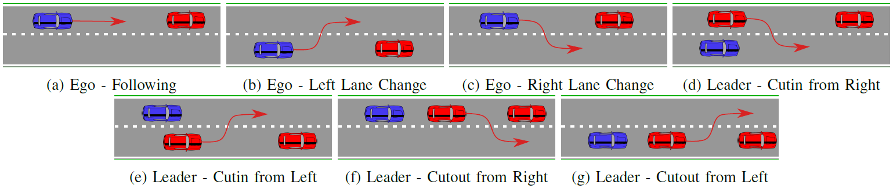

## Vote-Based-EVT

The official code for the repo: Open-set Recognition for the Detection of Unknown Traffic Scenarios Based on the Combination of Convolutional Neural Networks and Random Forests from Intelligent Vehicles 2021

## Dependencies
- Python (>=3.6)
- scikit-learn (0.21.0)
- scipy (1.5.2)
- numpy (0.19.0)
- Matlab 2020a
- Tensorflow (2.1)

## Table of Contents

1. [General descriptiopn
](#gs)
2. [Traffic Scenarios
](#ts)
3. [Vote-Based EVT
](#EVT)

## General description

The classes are divided into known and unknown classes. The known classes are chosen randomly and the process is repeated 5 times. The Macro F-Score of the known classes and the unknown class is calculated for the 5 different known class sets. The CNN trained in a supervised fashion for feature extraction and is used for feature extraction. Followed by which the Voter-Based EVT Model is trained and unknown classes are detected 
## Traffic Scenarios
The traffic scenarios are generated from the HighD Dataset [1]. 7 common highway scenarios are extracted from highD dataset. The 7 scenarios are as follows:

	- Ego - Following: The ego vehicle follows a leader vehicle.
	- Ego - Right lane change: The ego makes a lane change to the right lane.
	- Ego - Left lane change: The ego makes a lane change to the left lane.
	- Leader - Cutin from left: The leader vehicle  makes a lane change in front of the ego lane from the left lane of ego. 
	- Leader - Cutin from right: The leader vehicle  makes a lane change in front of the ego lane from the right lane of ego.
	- Leader - Cutout to left: The leader vehicle  makes a lane change from  the ego lane to the left lane of ego.
	- Leader - Cutout to right: The leader vehicle  makes a lane change  from  the ego lane from the right lane of ego.
	

## Vote-Based EVT

Please fill in the forms to request access to the HighD Data from https://www.highd-dataset.com/. 

Step 1: Generate scenario categories using the script `\Traffic_Scenarios\highD_generate_scenarios.m`, occupancy grids will be generated for the scenarios and saved for CNN+RF training

Step 2: Train the CNN and extract features for traffic scenarios using `python \Traffic_Scenarios\RF+EVT\ScenarioBasic.py`, followed by that to train the vote based model run the script `\Traffic_Scenarios\RF+EVT\Vote_Based_EVT.m`

Step 3:  Evaulation can be done by using the script `\Traffic_Scenarios\RF+EVT\VoteBasedEVTStat.py`

## Reference
[1] The highD Dataset: A Drone Dataset of Naturalistic Vehicle Trajectories on German Highways for Validation of Highly Automated Driving Systems, Krajewski et al., ITSC 2018
